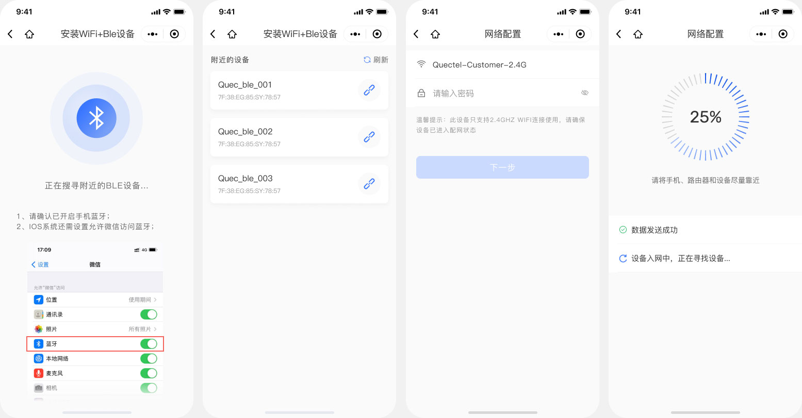
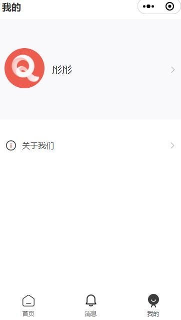
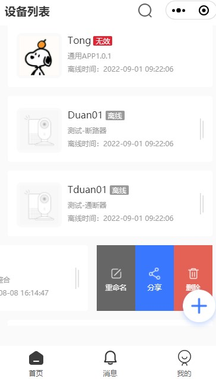
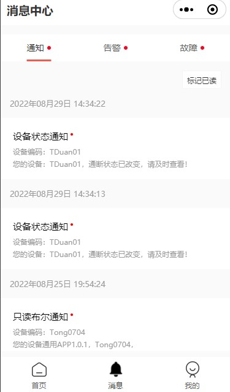
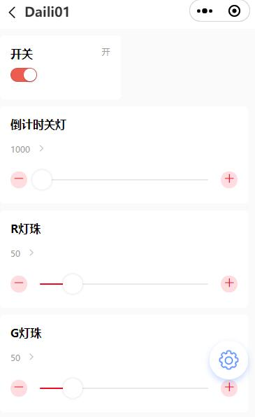

# 微信小程序SDK使用说明

## 一、功能列表
|功能模块 | 备注 | 
| -------  | -------- | 
| 蓝牙配网 | 蓝牙配网 | 
| 注册、登录、忘记密码 | 用户模块 | 
| 个人中心-我的 | 设备管理 | 
| 设备管理 | 设备分享 | 
| 设备分享 | 消息中心 | 
| 消息中心 | 消息中心 |
| 设备控制 | 设备控制 |
| webSocket接口 | 设备控制 |
| 网络配置 | 设备控制 |
| 主题配置 | 设备控制 | 

## 二、初始化
```
在小程序代码：app.json文件中
"plugins": {
  "quecPlugin": {
    "version": "1.1.1",
    "provider": "wx5e9a3feb8df9122e"
  }
}
```

## 三、蓝牙配网
### 1、功能点
```
涵盖功能点：
蓝牙搜索及设备列表、网络配置、网络配置结果;
```
### 2、实现方式
```
提供两种使用方式：
1、含页面布局组件：提供页面及整体配网流程，引用页面组件即可。详见"含页面布局组件使用"。
2、提供配网js接口，需要使用者根据业务自己编写页面。详见"蓝牙配网接口"。
```
### 3、含页面布局组件使用
```
在json文件定义需要引入的自定义组件时,使用plugin://协议指明插件的引用名和自定义组件名。
例如：
{
    "usingComponents": {
        "bluetooth_scan": "plugin://quecPlugin/bluetooth_scan", // 蓝牙搜索页面组件
        "bluetooth_wifi": "plugin://quecPlugin/bluetooth_wifi",  // wifi连接页面组件
        "bluetooth_analyse": "plugin://quecPlugin/bluetooth_analyse" // 配网页面组件
    }
}
```

组件效果图：


|组件 | 属性 | 说明 |类型 |默认值 |必填 |
| ---- | ---- | ---- |---- |---- |---- |
| bluetooth_analyse | connectTime |  设备配网超时时间 |number|30000（单位：毫秒） | 否 |
| bluetooth_scan | deviceImg |  设备列表图标 |string| - | 否 |
| bluetooth_scan | bleFailImg |  蓝牙连接失败图标 |string| - | 否 |
| bluetooth_scan | foundTime |  蓝牙搜索时间 |number|	60000（单位：毫秒） | 否 |
| bluetooth_scan | bleSearchImg |  蓝牙搜索图标 |string| - | 否 |
| bluetooth_wifi | pwdImg |  wifi连接页面左侧密码图标 |string |- | 否 |
| bluetooth_wifi | wifiImg |  wifi连接页面左侧wifi图标名称 |string |- | 否 |

### 4、蓝牙配网接口
#### 1) openBle
##### 功能描述
```
初始化蓝牙模块。
```
##### 参数
|属性 | 类型 | 默认值 |必填 |说明 |
| ---- | ---- | ---- |---- |---- |
| success | function |  - | 否 | 接口调用成功的回调函数 |
| fail | function |  - | 否 | 接口调用失败的回调函数 |
| complete | function |  - | 否 | 接口调用结束的回调函数（调用成功、失败都会执行） |

##### 返回码
|Code | 说明 |
| ---- | ---- |
| 200 | 蓝牙初始化成功 |
| 100000 | 手机蓝牙开启失败 |
| 100001 | 手机蓝牙不可用, 请开启蓝牙再试 |
| 100002 | 获取本机蓝牙适配器状态失败 |
| 100003 | 蓝牙搜索功能打开失败 |

##### 示例代码
```
const plugin = requirePlugin('quecPlugin')
 plugin.quecBle.openBle({
    success (res) {
         console.log(res)
     },
     fail (res) {
        console.log(JSON.stringify(res))
      }
 })
```

#### 2) onBLEDeviceFound
##### 功能描述
```
搜索附近的蓝牙设备。
```
##### 参数
|属性 | 类型 | 默认值 |必填 |说明 |
| ---- | ---- | ---- |---- |---- |
| callback | function |  - | 否 | 蓝牙低功耗设备的特征值变化事件的回调函数 |

##### Object.success回调（res）
|属性 | 类型 | 说明 |
| ---- | ---- | ---- |
| devices | Array Object |  搜索到的设备列表 |

##### 示例代码
```
const plugin = requirePlugin('quecPlugin')
 plugin.quecBle.onBLEDeviceFound({
    success (res) {
         console.log(res)
     },
     fail (res) {
        console.log(JSON.stringify(res))
      }
 })
```

#### 3) closeBle
##### 功能描述
```
关闭蓝牙模块。
```
##### 参数
|属性 | 类型 | 默认值 |必填 |说明 |
| ---- | ---- | ---- |---- |---- |
| success | function |  - | 否 | 接口调用成功的回调函数 |
| fail | function |  - | 否 | 接口调用失败的回调函数 |
| complete | function |  - | 否 | 接口调用结束的回调函数（调用成功、失败都会执行） |

##### 返回码
|Code | 说明 |
| ---- | ---- |
| 200 | 蓝牙模块关闭成功 |
| 100014 | 蓝牙模块关闭失败 |

##### 示例代码
```
const plugin = requirePlugin('quecPlugin')
 plugin.quecBle.closeBle({
    success (res) {
         console.log(res)
     },
     fail (res) {
        console.log(JSON.stringify(res))
      }
 })
```

#### 4) stopBleScan
##### 功能描述
```
停止搜寻附近的蓝牙外围设备。
```
##### 参数
|属性 | 类型 | 默认值 |必填 |说明 |
| ---- | ---- | ---- |---- |---- |
| success | function |  - | 否 | 接口调用成功的回调函数 |
| fail | function |  - | 否 | 接口调用失败的回调函数 |
| complete | function |  - | 否 | 接口调用结束的回调函数（调用成功、失败都会执行） |

##### 返回码
|Code | 说明 |
| ---- | ---- |
| 200 | 附近的蓝牙外围设备搜寻停止成功 |
| 100015 | 附近的蓝牙外围设备搜寻停止失败 |

##### 示例代码
```
const plugin = requirePlugin('quecPlugin')
 plugin.quecBle.stopBleScan({
    success (res) {
         console.log(res)
     },
     fail (res) {
        console.log(JSON.stringify(res))
      }
 })
```

#### 5) connectBLE
##### 功能描述
```
连接蓝牙低功耗设备。
```

##### 参数
|属性 | 类型 | 默认值 |必填 |说明 |
| ---- | ---- | ---- |---- |---- |
| deviceId | string |  - | 是 | 蓝牙设备 id |
| openDeviceFound | boolean |  false | 否 | 开启搜寻附近的蓝牙外围设备（如不是通过蓝牙搜索获取的deviceId,请传true） |
| timeout | number |  - | 否 | 超时时间，单位 ms，不填表示不会超时 |
| success | function |  - | 否 | 接口调用成功的回调函数 |
| fail | function |  - | 否 | 接口调用失败的回调函数 |
| complete | function |  - | 否 | 接口调用结束的回调函数（调用成功、失败都会执行） |

##### Object.success回调（res）
|属性 | 类型 | 说明 |
| ---- | ---- | ---- |
| serviceId | string |  设备服务ID | 
| characteristicId | string |  设备特征ID | 

##### 返回码
|Code | 说明 |
| ---- | ---- |
| 200 | 蓝牙初始化成功 |
| 100000 | 手机蓝牙开启失败 |
| 100001 | 手机蓝牙不可用, 请开启蓝牙再试 |
| 100002 | 获取本机蓝牙适配器状态失败 |
| 100003 | 蓝牙搜索功能打开失败 |
| 100005 | 连接蓝牙失败 |
| 100006 | 蓝牙获取失败 |
| 100007 | 获取特征值失败 |
| 100013 | 设备不存在 |

##### 示例代码
```
const plugin = requirePlugin('quecPlugin')
 plugin.quecBle.connectBLE({
     deviceId:"",
    success (res) {
         console.log(res)
     },
     fail (res) {
        console.log(JSON.stringify(res))
      }
 })
```

#### 6) openNotifyBLE
##### 功能描述
```
启用蓝牙低功耗设备特征值变化时的 otify功能，订阅特征。
注意：必须设备的特征支持 notify 或者 indicate 才可以成功调用。
另外，必须先启用 wx.notifyBLECharacteristicValueChange才能监听到设备 characteristicValueChange 事件。
```

##### 参数
|属性 | 类型 | 默认值 |必填 |说明 |
| ---- | ---- | ---- |---- |---- |
| deviceId | string |  - | 是 | 蓝牙设备 id |
| serviceId | string |  - | 是 | 蓝牙特征对应服务的 UUID |
| characteristicId | string |  - | 是 | 蓝牙特征的 UUID |
| state | boolean |  true | 是 | 是否启用 notify |
| type | string |  indication | 是 | 设置特征订阅类型，有效值有 notification 和 indication |
| success | function |  - | 否 | 接口调用成功的回调函数 |
| fail | function |  - | 否 | 接口调用失败的回调函数 |
| complete | function |  - | 否 | 接口调用结束的回调函数（调用成功、失败都会执行） |

##### Object.success回调（res）
|属性 | 类型 | 说明 |
| ---- | ---- | ---- |
| serviceId | string |  设备服务ID |
| characteristicId | string |  设备特征ID |

##### 返回码
|Code | 说明 |
| ---- | ---- |
| 200 | 启用低功耗蓝牙设备特征值变化时的notify功能成功 |
| 100008 | 启用低功耗蓝牙设备特征值变化时的notify功能失败 |

##### 示例代码
```
const plugin = requirePlugin('quecPlugin')
 plugin.quecBle.openNotifyBLE({
     deviceId:'',
     serviceId:'',
     characteristicId:'',
     state:true,
     type:'notification',
    success (res) {
         console.log(res)
     },
     fail (res) {
        console.log(JSON.stringify(res))
      }
 })
```

#### 7) writeBLECharacteristicValue
##### 功能描述
```
向蓝牙低功耗设备特征值中写入二进制数据。
注意：必须设备的特征支持 write 才可以成功调用。
```

##### 参数
|属性 | 类型 | 默认值 |必填 |说明 |
| ---- | ---- | ---- |---- |---- |
| deviceId | string |  - | 是 | 蓝牙设备 id |
| serviceId | string |  - | 是 | 蓝牙特征对应服务的 UUID |
| characteristicId | string |  - | 是 | 蓝牙特征的 UUID |
| ssid | string |  - | 是 | Wi-Fi 的 SSID |
| password | string |  - | 是 | Wi-Fi 设备密码 |
| writeType | string |  - | 否 | 蓝牙特征值的写模式设置，有两种模式，iOS 优先 write，安卓优先 writeNoResponse 。（基础库 2.22.0 开始支持） |
| success | function |  - | 否 | 接口调用成功的回调函数 |
| fail | function |  - | 否 | 接口调用失败的回调函数 |
| complete | function |  - | 否 | 接口调用结束的回调函数（调用成功、失败都会执行） |

##### Object.success回调（res）
|属性 | 类型 | 说明 |
| ---- | ---- | ---- |
| networkState | number |  1表示写入成功 |

##### 返回码
|Code | 说明 |
| ---- | ---- |
| 100009 | 写入数据失败 |

##### 示例代码
```
const plugin = requirePlugin('quecPlugin')
 plugin.quecBle.writeBLECharacteristicValue({
     deviceId:'',
     serviceId:'',
     characteristicId:'',
     ssid:'',
     password:'',
    success (res) {
         console.log(res)
     },
     fail (res) {
        console.log(JSON.stringify(res))
      }
 })
```

#### 8) onBLECharacteristicValueChange
##### 功能描述
```
监听蓝牙低功耗设备的特征值变化事件。
必须先调用 openNotifyBLE 接口才能接收到设备推送的绑定信息。
```
##### 参数
|属性 | 类型 | 默认值 |必填 |说明 |
| ---- | ---- | ---- |---- |---- |
| success | function |  - | 否 | 接口调用成功的回调函数 |
| fail | function |  - | 否 | 接口调用失败的回调函数 |
| complete | function |  - | 否 | 接口调用结束的回调函数（调用成功、失败都会执行） |

##### Object.success回调（res）
|属性 | 类型 | 说明 |
| ---- | ---- | ---- |
| productKey | string |  产品Productkey |
| deviceKey | string|  设备Devicekey |
| bindCode |string |  绑定信息 |
| networkState |number |  2 表示配网成功 |

##### 返回码
|Code | 说明 |
| ---- | ---- |
| 100011 | 低功耗蓝牙设备的特征值监听失败 |

##### 示例代码
```
const plugin = requirePlugin('quecPlugin')
 plugin.quecBle.onBLECharacteristicValueChange({
    success (res) {
         console.log(res)
     },
     fail (res) {
        console.log(JSON.stringify(res))
      }
 })
```

#### 9) closeBLEConnection
##### 功能描述
```
断开与蓝牙低功耗设备的连接。
```

##### 参数
|属性 | 类型 | 默认值 |必填 |说明 |
| ---- | ---- | ---- |---- |---- |
| deviceId | string |  - | 是 | 蓝牙设备 id |
| success | function |  - | 否 | 接口调用成功的回调函数 |
| fail | function |  - | 否 | 接口调用失败的回调函数 |
| complete | function |  - | 否 | 接口调用结束的回调函数（调用成功、失败都会执行） |

##### 返回码
|Code | 说明 |
| ---- | ---- |
| 100010 | 低功耗蓝牙设备的连接断开失败 |

##### 示例代码
```
const plugin = requirePlugin('quecPlugin')
 plugin.quecBle.closeBLEConnection({
     deviceId:'',
    success (res) {
         console.log(res)
     },
     fail (res) {
        console.log(JSON.stringify(res))
      }
 })
```

#### 10) getCurentWifi
##### 功能描述
```
获取当前已连接wifi信息。
```

##### 参数
|属性 | 类型 | 默认值 |必填 |说明 |
| ---- | ---- | ---- |---- |---- |
| success | function |  - | 否 | 接口调用成功的回调函数 |
| fail | function |  - | 否 | 接口调用失败的回调函数 |
| complete | function |  - | 否 | 接口调用结束的回调函数（调用成功、失败都会执行） |

##### Object.success回调（res）
|属性 | 类型 | 说明 |
| ---- | ---- | ---- |
| ssid | string |  Wi-Fi 的 SSID |


##### 返回码
|Code | 说明 |
| ---- | ---- |
| 100004 | wifi获取失败 |

##### 示例代码
```
const plugin = requirePlugin('quecPlugin')
 plugin.quecBle.getCurentWifi({
    success (res) {
         console.log(res)
     },
     fail (res) {
        console.log(JSON.stringify(res))
      }
 })
```

#### 11) closeWifi
##### 功能描述
```
关闭Wi-Fi模块。
```

##### 参数
|属性 | 类型 | 默认值 |必填 |说明 |
| ---- | ---- | ---- |---- |---- |
| success | function |  - | 否 | 接口调用成功的回调函数 |
| fail | function |  - | 否 | 接口调用失败的回调函数 |
| complete | function |  - | 否 | 接口调用结束的回调函数（调用成功、失败都会执行） |

##### 返回码
|Code | 说明 |
| ---- | ---- |
| 200 | wiFi模块关闭成功 |
| 100012 | wiFi模块关闭失败 |

##### 示例代码
```
const plugin = requirePlugin('quecPlugin')
 plugin.quecBle.closeWifi({
    success (res) {
         console.log(res)
     },
     fail (res) {
        console.log(JSON.stringify(res))
      }
 })
```

## 四、注册、登录、忘记密码
### 1、功能点
```
涵盖功能点：
1、手机号、邮箱注册
2、手机号、邮箱密码登录、微信一键登录
3、手机号验证码登录
4、手机号、邮箱忘记密码
```
### 2、实现方式
```
提供两种实现方式：
1、含页面布局组件：提供页面流程，引用组件即可。 详见"含页面布局组件使用"。
2、提供注册、登录、忘记密码js接口，需要使用者根据业务自己编写页面。 详见"注册、登录、忘记密码接口"。
```
### 3、含页面布局组件使用
#### 1）组件引用

```
在json文件定义需要引入的自定义组件时,使用plugin://协议指明插件的引用名和自定义组件名。
例如：
{
  "usingComponents": {
    "wx_login":"plugin://quecPlugin/wx_login", //微信一键登录
    "user_login": "plugin://quecPlugin/user_login", //登录
    "user_login_code": "plugin://quecPlugin/user_login_code", //验证码登录
    "user_forget_pwd": "plugin://quecPlugin/user_forget_pwd", //忘记密码
    "user_reset_pwd": "plugin://quecPlugin/user_reset_pwd", //忘记密码重置密码
    "user_register": "plugin://quecPlugin/user_version", //注册
    "user_register_pwd": "plugin://quecPlugin/user_cancel", //注册设置密码
  }
}
```
#### 2）组件效果图


#### 3）组件说明
| 组件              | 属性          | 说明                                                    | 类型    | 默认值           | 必填 | 事件                                                                                                  |
| ----------------- | ------------- | ------------------------------------------------------- | ------- | ---------------- | ---- | ----------------------------------------------------------------------------------------------------- |
| wx_login | agreecheck| 是否勾选隐私协议 | boolean | false | 否   | wxLoginSuccess-微信一键登录成功回调 |
| user_start | agreecheck | 是否勾选隐私协议  | boolean  | false | 否   | toLogin-跳转到手机号/邮箱登录页面 |
| user_start | btnStyle   | 按钮样式  | string | - | 否  |          |
| user_login | btnStyle | 按钮样式 | string  | -  | 否 | toCodeLogin-跳转到验证码登录页面; toForgetPwd-跳转到忘记密码页面; loginSuccess-登录成功回调                                                                             |
| user_login_code   | protocolCheck | 是否勾选隐私协议                                        | boolean | false            | 否   | loginSuccess- 登录成功回调                                                                            |
| user_login_code   | btnStyle      | 按钮样式                                                | string  | -                | 否   | -                                                                                                     |
| user_forget_pwd   | btnStyle      | 按钮样式                                                | string  | -                | 否   | validateSuccess-验证码验证通过跳转到重置密码页面 （可在事件中参数中获取手机号/邮箱uname，验证码code） |
| user_reset_pwd    | detail        | user_forget_pwd组件中传递的手机号/邮箱uname，验证码code | Object  | {}  | 是   | resetSuccess-密码重置成功回调；emailCodeValid-邮箱验证码错误后回调                                    |
| user_register     | protocolCheck | 是否勾选隐私协议                                        | boolean | false            | 否   | codeSuccess-验证码验证通过跳转设置密码页面  |
| user_register     | btnStyle      | 按钮样式                                                | string  | -                | 否   | -                                                    |
| user_register_pwd | btnStyle      | 按钮样式                                                | string  | -                | 否   | -    |regSuccess-注册成功回调；emailCodeValid-邮箱验证码错误后回调
| user_register_pwd   |  curItem   |  user_register_pwd组件中传递的手机号/邮箱uname，验证码code |  Object       |  {}  |   是  |          |

#### 4）微信一键登录具体实现

```
在插件开发中，部分API受限制，无法在插件中直接使用，如：获取用户信息，获取用户号码等，因此微信一键登录组件，采用抽象节点的方式实现。
1)小程序miniprogram端app.json中，配置插件信息
  "plugins": {
    "wxscan-plugin": {
      "version": "dev",
      "provider": "wx5e9a3feb8df9122e"
    }
  }

2)小程序miniprogram端components中新建wx_info组件，将用户信息getUserInfo及手机号信息getPhoneNumber通过事件绑定传递出去,同时设置如下属性：
phoneVisible-是否展示获取用户号码授权弹框
isCheck-是否勾选用户协议

3）plugin中components新建wx_login组件
wx_login/index.js：调用接口api实现微信登录的逻辑，将登录的结果绑定wxLoginSuccess事件
wx_login/index.json：
"componentGenerics": {
  "wx_info": true
}
wx_login/index.wxml:
<wx_info 
  bind:getPhoneNumber="getPhoneNumber" 
  bind:getUserInfo="getUserInfo" 
  phoneVisible="{{phoneNoVisible}}" 
  isCheck="{{agreecheck}}" 
/>

4）plugin 中plugin.json中配置：
  "publicComponents": {
    "wx_login": "components/user/wx_login/index",
  }

5）小程序端页面调用：
json文件中配置
"usingComponents": {
  "wx_login": "plugin://wxscan-plugin/wx_login",
  "login-btn": "../../components/wx_info/index"
}
wxml文件中：
 <wx_login generic:wx_info="wx_info" agreecheck="{{checked}}" bindwxLoginSuccess="loginResult"></wx_login>
```

### 4、注册、登录、忘记密码接口
#### 1) wxLogin 
##### 功能描述
```
微信一键登录。
```
##### 参数
|属性 | 类型 | 默认值 |必填 |说明 |
| ---- | ---- | ---- |---- |---- |
| appId | string |  - | 是 | 微信appId |
| authorizedMobliePhone | boolean |  true | 是 | 是否需要用户授权手机号，默认为true |
| authorizedUserInfo | boolean |  true | 是 | 是否需要用户授权用户信息，默认为true |
| wxCode | string |  - | 是 | 微信授权Code |
| wxUserInfoDecrypData | object |  - | 否 | 微信用户信息加密信息(encryptedData、iv) |
| random | string |  - | 否 | 随机数 |
| wxPhoneDecryptData | object |  - | 否 | 手机号加密信息(encryptedData、iv) |
| success | function |  - | 否 | 接口调用成功的回调函数 |
| fail | function |  - | 否 | 接口调用失败的回调函数 |
| complete | function |  - | 否 | 接口调用结束的回调函数（调用成功、失败都会执行） |
##### 示例代码
```
const plugin = requirePlugin('quecPlugin')
第一次调用拿到random
 plugin.quecUser.wxLogin({
     appId:appId,
     authorizedMobliePhone: true,
     authorizedUserInfo: true,
     wxCode: wxCode,
     success (res) {
         console.log(res)
     },
     fail (res) {
        console.log(JSON.stringify(res))
      }
 })
 
 第二次调用，传递random，wxUserInfoDecrypData，wxPhoneDecryptData
 plugin.quecUser.wxLogin({
     appId:appId,
     authorizedMobliePhone: true,
     authorizedUserInfo: true,
     wxCode: wxCode,
     wxUserInfoDecrypData:wxUserInfoDecrypData,
     wxPhoneDecryptData:wxPhoneDecryptData,
     random:random
     success (res) {
         console.log(res)
     },
     fail (res) {
        console.log(JSON.stringify(res))
      }
 })
```


#### 2) sendPhoneSmsCode
##### 功能描述
```
发送手机短信验证码。
```
##### 参数
| 属性              | 类型     | 默认值 | 必填 | 说明                                             |
| ----------------- | -------- | ------ | ---- | ------------------------------------------------ |
| internationalCode | string   | '86'   | 否   | 国家码                                           |
| phone   | string   | -      | 是   | 手机号  |
| ssid              |  string       |   -    |    是 |   企业短信签名ID   ('C1'-阿里云)                                            |
| stid                  |    string      |   -     |   是  |   企业短信模板ID  ( 'C1'-国内忘记密码；'C2'-国内登录; 'C3'-国内注册; 'C7'- 国内账号注销；'C4'-国际忘记密码；'C5'-国际登录; 'C6'-国际注册; 'C8'- 国际账号注销)                                            |
| success           | function | -      | 否   | 接口调用成功的回调函数                           |
| fail              | function | -      | 否   | 接口调用失败的回调函数                           |
| complete          | function | -      | 否   | 接口调用结束的回调函数（调用成功、失败都会执行） |

##### 示例代码
```
const plugin = requirePlugin('quecPlugin')
 plugin.quecUser.sendPhoneSmsCode({
     internationalCode: '86',
    phone: '18095653439',
    ssid: 'C1',
    stid: 'C3',
    success (res) {
         console.log(res)
     },
     fail (res) {
        console.log(JSON.stringify(res))
      }
 })
```
#### 3) validateSmsCode
##### 功能描述
```
验证短信验证码。
```
##### 参数
| 属性              | 类型     | 默认值 | 必填 | 说明                                             |
| ----------------- | -------- | ------ | ---- | ------------------------------------------------ |
| internationalCode | string   | '86'   | 否   | 国家码                                           |
| phone             | string   | -      | 是   | 手机号                                           |
| smsCode           | string   | -      | 是   | 短信验证码                                       |
| isDisabled                  |    number      |    1    |   否   | 验证码验证后是否失效，1：失效 2：不失效，默认 1   |
| success           | function | -      | 否   | 接口调用成功的回调函数                           |
| fail              | function | -      | 否   | 接口调用失败的回调函数                           |
| complete          | function | -      | 否   | 接口调用结束的回调函数（调用成功、失败都会执行） |

##### 示例代码
```
const plugin = requirePlugin('quecPlugin')
 plugin.quecUser.validateSmsCode({
     internationalCode: '86',
    phone: '18095653439',
    smsCode: '123542',
    isDisabled:2,
    success (res) {
         console.log(res)
     },
     fail (res) {
        console.log(JSON.stringify(res))
      }
 })
```
#### 4) isPhoneRegister
##### 功能描述
```
验证手机号是否注册。
```
##### 参数
| 属性              | 类型     | 默认值 | 必填 | 说明                                             |
| ----------------- | -------- | ------ | ---- | ------------------------------------------------ |
| internationalCode | string   | '86'   | 否   | 国家码                                           |
| phone             | string   | -      | 是   | 手机号                                           |
| success           | function | -      | 否   | 接口调用成功的回调函数                           |
| fail              | function | -      | 否   | 接口调用失败的回调函数                           |
| complete          | function | -      | 否   | 接口调用结束的回调函数（调用成功、失败都会执行） |

##### 示例代码
```
const plugin = requirePlugin('quecPlugin')
 plugin.quecUser.isPhoneRegister({
     internationalCode: '86',
    phone: '18095653439',
    success (res) {
         console.log(res)
     },
     fail (res) {
        console.log(JSON.stringify(res))
      }
 })
```
#### 5) phonePwdRegister
##### 功能描述
```
手机号注册。
```
##### 参数
| 属性              | 类型     | 默认值 | 必填 | 说明                                             |
| ----------------- | -------- | ------ | ---- | ------------------------------------------------ |
| internationalCode | string   | '86'   | 否   | 国家码                                           |
| phone             | string   | -      | 是   | 手机号                                           |
| pwd               |    string      |    -    |   是   |         密码                                         |
| smsCode           |  string        |  -      |   是   |      验证码                                            |
| lang              | string         |  -      |    否  |   语言                                               |
| nationality                  |     string     |  -     |  否   |    国家                                             |
| success           | function | -      | 否   | 接口调用成功的回调函数                           |
| fail              | function | -      | 否   | 接口调用失败的回调函数                           |
| complete          | function | -      | 否   | 接口调用结束的回调函数（调用成功、失败都会执行） |

##### 示例代码
```
const plugin = requirePlugin('quecPlugin')
 plugin.quecUser.phonePwdRegister({
    phone: '18095653439',
    pwd:'a123456',
    smsCode:'210320',
    success (res) {
         console.log(res)
     },
     fail (res) {
        console.log(JSON.stringify(res))
      }
 })
```
#### 6) phonePwdLogin
##### 功能描述
```
手机号密码登录。
```
##### 参数
| 属性              | 类型     | 默认值 | 必填 | 说明                                             |
| ----------------- | -------- | ------ | ---- | ------------------------------------------------ |
| internationalCode | string   | '86'   | 否   | 国家码                                           |
| phone             | string   | -      | 是   | 手机号                                           |
| pwd               |    string      |    -    |   是   |         密码                                         |
| success           | function | -      | 否   | 接口调用成功的回调函数                           |
| fail              | function | -      | 否   | 接口调用失败的回调函数                           |
| complete          | function | -      | 否   | 接口调用结束的回调函数（调用成功、失败都会执行） |

##### 示例代码
```
const plugin = requirePlugin('quecPlugin')
 plugin.quecUser.phonePwdLogin({
    phone: '18095653439',
    pwd:'a123456',
    success (res) {
         console.log(res)
     },
     fail (res) {
        console.log(JSON.stringify(res))
      }
 })
```

#### 7) phoneSmsCodeLogin
##### 功能描述
```
手机号验证码登录。
```
##### 参数
| 属性              | 类型     | 默认值 | 必填 | 说明                                             |
| ----------------- | -------- | ------ | ---- | ------------------------------------------------ |
| internationalCode | string   | '86'   | 否   | 国家码                                           |
| phone             | string   | -      | 是   | 手机号                                           |
| smsCode               |    string      |    -    |   是   |        验证码                                     |
| success           | function | -      | 否   | 接口调用成功的回调函数                           |
| fail              | function | -      | 否   | 接口调用失败的回调函数                           |
| complete          | function | -      | 否   | 接口调用结束的回调函数（调用成功、失败都会执行） |

##### 示例代码
```
const plugin = requirePlugin('quecPlugin')
 plugin.quecUser.phoneSmsCodeLogin({
    phone: '18095653439',
    smsCode:'120321',
    success (res) {
         console.log(res)
     },
     fail (res) {
        console.log(JSON.stringify(res))
      }
 })
```
#### 8) sendEmailRegisterCode
##### 功能描述
```
发送邮件注册验证码。
```
##### 参数
| 属性              | 类型     | 默认值 | 必填 | 说明                                             |
| ----------------- | -------- | ------ | ---- | ------------------------------------------------ |
| email             | string   | -      | 是   | 邮箱                                           |
| success           | function | -      | 否   | 接口调用成功的回调函数                           |
| fail              | function | -      | 否   | 接口调用失败的回调函数                           |
| complete          | function | -      | 否   | 接口调用结束的回调函数（调用成功、失败都会执行） |

##### 示例代码
```
const plugin = requirePlugin('quecPlugin')
 plugin.quecUser.sendEmailRegisterCode({
    email: 'daney.hong@quectel.com',
    success (res) {
         console.log(res)
     },
     fail (res) {
        console.log(JSON.stringify(res))
      }
 })
```
#### 9) emailPwdRegister
##### 功能描述
```
邮箱注册。
```
##### 参数
| 属性              | 类型     | 默认值 | 必填 | 说明                                             |
| ----------------- | -------- | ------ | ---- | ------------------------------------------------ |
| timezone | number   | 8   | 否   | 时区                                           |
| email             | string   | -      | 是   | 邮箱                                         |
| pwd               |    string      |    -    |   是   |         密码                                         |
| code           |  string        |  -      |   是   |      验证码                                            |
| lang              | string         |  -      |    否  |   语言                                               |
| nationality                  |     string     |  -     |  否   |    国家                                             |
| success           | function | -      | 否   | 接口调用成功的回调函数                           |
| fail              | function | -      | 否   | 接口调用失败的回调函数                           |
| complete          | function | -      | 否   | 接口调用结束的回调函数（调用成功、失败都会执行） |

##### 示例代码
```
const plugin = requirePlugin('quecPlugin')
 plugin.quecUser.emailPwdRegister({
    email: 'daney.hong@quectel.com',
    pwd:'a123456',
    code:'160210',
    success (res) {
         console.log(res)
     },
     fail (res) {
        console.log(JSON.stringify(res))
      }
 })
```
#### 10) emailPwdLogin
##### 功能描述
```
邮箱密码登录。
```
##### 参数
| 属性              | 类型     | 默认值 | 必填 | 说明                                             |
| ----------------- | -------- | ------ | ---- | ------------------------------------------------ |
| email             | string   | -      | 是   | 邮箱                                       |
| pwd               |    string      |    -    |   是   |         密码                                         |
| success           | function | -      | 否   | 接口调用成功的回调函数                           |
| fail              | function | -      | 否   | 接口调用失败的回调函数                           |
| complete          | function | -      | 否   | 接口调用结束的回调函数（调用成功、失败都会执行） |

##### 示例代码
```
const plugin = requirePlugin('quecPlugin')
 plugin.quecUser.emailPwdLogin({
    email: 'daney.hong@quectel.com',
    pwd:'a123456',
    success (res) {
         console.log(res)
     },
     fail (res) {
        console.log(JSON.stringify(res))
      }
 })
```
#### 11) sendEmailRepwdCode
##### 功能描述
```
发送邮件重置验证码。
```
##### 参数
| 属性              | 类型     | 默认值 | 必填 | 说明                                             |
| ----------------- | -------- | ------ | ---- | ------------------------------------------------ |
| email             | string   | -      | 是   | 邮箱                                       |
| success           | function | -      | 否   | 接口调用成功的回调函数                           |
| fail              | function | -      | 否   | 接口调用失败的回调函数                           |
| complete          | function | -      | 否   | 接口调用结束的回调函数（调用成功、失败都会执行） |

##### 示例代码
```
const plugin = requirePlugin('quecPlugin')
 plugin.quecUser.sendEmailRepwdCode({
    email: 'daney.hong@quectel.com',
    success (res) {
         console.log(res)
     },
     fail (res) {
        console.log(JSON.stringify(res))
      }
 })
```
#### 12) userPwdReset
##### 功能描述
```
通过手机号码或邮箱重置用户密码。（手机号码或邮箱 二选一）
```
##### 参数
| 属性     | 类型     | 默认值 | 必填 | 说明                                             |
| -------- | -------- | ------ | ---- | ------------------------------------------------ |
| code     | string   | -      | 是   | 验证码                                           |
| email    |   string      | -       |    否  |        邮箱                                          |
| phone    |    string      |-        |   否   |       手机号                                           |
| pwd      |  string        |     -   |   否   |          密码                                        |
| internationalCode         |    string     |    ‘86’   |    否  |       国家码                                          |
| success  | function | -      | 否   | 接口调用成功的回调函数                           |
| fail     | function | -      | 否   | 接口调用失败的回调函数                           |
| complete | function | -      | 否   | 接口调用结束的回调函数（调用成功、失败都会执行） |

##### 示例代码
```
const plugin = requirePlugin('quecPlugin')
 plugin.quecUser.userPwdReset({
    email: 'daney.hong@quectel.com',
    code:'321010',
    success (res) {
         console.log(res)
     },
     fail (res) {
        console.log(JSON.stringify(res))
      }
 })
```


## 五、个人中心-我的
### 1、功能点
```
涵盖功能点：
个人信息-展示、修改头像、修改昵称、修改密码、退出登录;
关于我们-服务协议、隐私政策、当前版本、关于移远;
```
### 2、实现方式
```
提供两种实现方式：
1、含页面布局组件：提供页面流程，引用组件即可。详见"含页面布局组件使用"。
2、提供个人中心-我的js接口，需要使用者根据业务自己编写页面。详见"个人中心-我的接口"。
```
### 3、含页面布局组件使用
#### 1）组件引用
```
在json文件定义需要引入的自定义组件时,使用plugin://协议指明插件的引用名和自定义组件名。
例如：
{
  "usingComponents": {
    "account_logout": "plugin://quecPlugin/account_logout", //退出
    "account_info": "plugin://quecPlugin/account_info", //用户信息展示
    "account_nickname": "plugin://quecPlugin/account_nickname", //昵称修改
    "account_about": "plugin://quecPlugin/account_about", //关于我们
    "account_version": "plugin://quecPlugin/account_version", //当前版本
    "account_cancel": "plugin://quecPlugin/account_cancel", //注销用户
    "account_edit_pwd": "plugin://quecPlugin/account_edit_pwd", //修改密码
  }
}
```
#### 2）组件效果图


#### 3）组件说明
|组件 | 属性 | 说明 |类型 |默认值 |必填 | 事件
| ---- | ---- | ---- |---- |---- |---- |---- |
| account_logout | btnStyle |  按钮样式 | string | - | 否 |logoutSuccess-退出成功
| account_info | - |  - | - | - | - | goNikeName-跳转到修改昵称页面; goChangePwd-跳转到修改密码页面; logoutSuccess-退出成功回调
| account_nickname | btnStyle |  按钮样式 | string | - | 否 | nicknameEditSuccess-昵称修改成功
| account_about | imgTxt |  设置icon图标下面的标题 | string | 移块上云 | 否 |goProtocol-跳转用户协议页面；goPrivacy-跳转隐私协议页面
| account_about | version |  版本号 | string | V1.0.0 | 否 | goVersion-跳转到当前版本页面、goAboutQuec-跳转调关于移远页面
| account_version | phone |  电话 | string | +86 0551-65869386 | 否 |
| account_version | version |  版本号 | string | V1.0.0 | 否 |
| account_cancel | btnStyle |  按钮样式 | string | - | 否 |
| account_edit_pwd | btnStyle |  按钮样式 | string | - | 否 |changePwdSuccess-密码修改成功回调

### 4、个人中心-我的接口
#### 1) getUInfo
##### 功能描述
```
获取用户信息。
```
##### 参数
|属性 | 类型 | 默认值 |必填 |说明 |
| ---- | ---- | ---- |---- |---- |
| success | function |  - | 否 | 接口调用成功的回调函数 |
| fail | function |  - | 否 | 接口调用失败的回调函数 |
| complete | function |  - | 否 | 接口调用结束的回调函数（调用成功、失败都会执行） |

##### 示例代码
```
const plugin = requirePlugin('quecPlugin')
 plugin.quecAccount.getUInfo({
     success (res) {
         console.log(res)
     },
     fail (res) {
        console.log(JSON.stringify(res))
      }
 })
```

#### 2) userLogout 
##### 功能描述
```
退出登录。
```
##### 参数
|属性 | 类型 | 默认值 |必填 |说明 |
| ---- | ---- | ---- |---- |---- |
| success | function |  - | 否 | 接口调用成功的回调函数 |
| fail | function |  - | 否 | 接口调用失败的回调函数 |
| complete | function |  - | 否 | 接口调用结束的回调函数（调用成功、失败都会执行） |

##### 示例代码
```
const plugin = requirePlugin('quecPlugin')
 plugin.quecAccount.userLogout({
     success (res) {
         console.log(res)
     },
     fail (res) {
        console.log(JSON.stringify(res))
      }
 })
```

#### 3) userCancel 
##### 功能描述
```
用户注销。
```
##### 参数
|属性 | 类型 | 默认值 |必填 |说明 |
| ---- | ---- | ---- |---- |---- |
| type | number |  默认为 7 天后删除 | 否 | 删除类型：1- 立即删除 2- 7天后删除，默认为 7 天后删除 |
| success | function |  - | 否 | 接口调用成功的回调函数 |
| fail | function |  - | 否 | 接口调用失败的回调函数 |
| complete | function |  - | 否 | 接口调用结束的回调函数（调用成功、失败都会执行） |
##### 示例代码
```
const plugin = requirePlugin('quecPlugin')
 plugin.quecAccount.userCancel({
     type:1,
     success (res) {
         console.log(res)
     },
     fail (res) {
        console.log(JSON.stringify(res))
      }
 })
```

#### 4) editNickname 
##### 功能描述
```
修改昵称。
```
##### 参数
|属性 | 类型 | 默认值 |必填 |说明 |
| ---- | ---- | ---- |---- |---- |
| nikeName | string |  - | 是 | 昵称 |
| success | function |  - | 否 | 接口调用成功的回调函数 |
| fail | function |  - | 否 | 接口调用失败的回调函数 |
| complete | function |  - | 否 | 接口调用结束的回调函数（调用成功、失败都会执行） |
##### 示例代码
```
const plugin = requirePlugin('quecPlugin')
 plugin.quecAccount.editNickname({
     nikeName:'移块上云',
     success (res) {
         console.log(res)
     },
     fail (res) {
        console.log(JSON.stringify(res))
      }
 })
```

#### 5) pickImg 
##### 功能描述
```
头像上传。
```
##### 参数
|属性 | 类型 | 默认值 |必填 |说明 |
| ---- | ---- | ---- |---- |---- |
| success | function |  - | 否 | 接口调用成功的回调函数 |
| fail | function |  - | 否 | 接口调用失败的回调函数 |
| complete | function |  - | 否 | 接口调用结束的回调函数（调用成功、失败都会执行） |
##### 示例代码
```
const plugin = requirePlugin('quecPlugin')
 plugin.quecAccount.pickImg({
     success (res) {
         console.log(res)
     },
     fail (res) {
        console.log(JSON.stringify(res))
      }
 })
```

#### 6) changePwd 
##### 功能描述
```
修改登录密码。
```
##### 参数
| 属性     | 类型     | 默认值 | 必填 | 说明                                             |
| -------- | -------- | ------ | ---- | ------------------------------------------------ |
| success  | function | -      | 否   | 接口调用成功的回调函数                           |
| fail     | function | -      | 否   | 接口调用失败的回调函数                           |
| complete | function | -      | 否   | 接口调用结束的回调函数（调用成功、失败都会执行） |
| oldPwd   |  string     |  -      |   是   |    原密码  |
| newPwd  | string  | -        |   是   |   新密码   |

##### 示例代码
```
const plugin = requirePlugin('quecPlugin')
 plugin.quecAccount.changePwd({
     oldPwd:oldPwd,
     newPwd:newPwd,
     success (res) {
         console.log(res)
     },
     fail (res) {
        console.log(JSON.stringify(res))
      }
 })
```

## 六、设备管理
### 1、功能点
```
涵盖功能点：设备扫描安装、设备列表（展示、重命名、删除）、设备搜索
```

### 2、实现方式
```
提供两种实现方式：
1、含页面布局组件：提供页面流程，引用组件即可。详见"含页面布局组件使用"。
2、提供设备管理js接口，需要使用者根据业务自己编写页面。详见"设备管理接口"。
```
### 3、含页面布局组件使用
#### 1）组件引用
```
在json文件定义需要引入的自定义组件时,使用plugin://协议指明插件的引用名和自定义组件名。
{
  "usingComponents": {
      "device_add": "plugin://quecPlugin/device_add",   // 设备扫码安装
      "device_list": "plugin://quecPlugin/device_list",   // 设备列表
      "device_rename": "plugin://quecPlugin/device_rename",   // 设备详情更多设置-重命名
      "device_search": "plugin://quecPlugin/device_search", //设备搜索
  }
}
```
#### 2）组件效果图


#### 3）组件说明
|组件 | 属性 | 说明 |类型 |默认值 |必填 |事件
| ---- | ---- | ---- |---- |---- |---- |---- |
| device_add | item |  扫描的返回的结果信息 | Object |- | 是 | scanSuccess-扫描成功回调
| device_add | btnStyle |  按钮样式 |string| - | 否 | addSuccess-添加成功回调
| device_list | actionBg |  重命名、分享、删除背景色 |Object|	actionBg:{rename:#666666; share: '#3A77FF';del: '#E46155'}| 否 | scanSuccess-扫描成功回调
| device_list | isRefresh |  是否刷新列表 | boolean | false | 否 | renameSuccess-重命名成功回调、addSuccess-添加成功回调
| device_list | slideImg |  设置列表右滑图片 | string | /assets/images/device/slide.png | 否 | goDetail-跳转到设备详情
| device_list | renameImg |  设置列表重命名图片 | string | /assets/images/device/rename.png | 否 | goShare-跳转到分享
| device_list | shareImg |  设置列表分享图片 | string | /assets/images/device/share.png | 否 | unbindSuccess-删除成功回调
| device_list | delImg |  设置列表删除图片 | string | /assets/images/device/del.png | 否 |
| device_list | noDataImg |  设置列表无数据展示图片 | string | /assets/images/device/no_device_data.png | 否 |
| device_rename | btnStyle |  按钮样式 |string| - | 否 | renameSuccess-重命名成功回调
| device_rename | curItem |  当前设备数据信息 | string| - | 否 |

### 4、设备管理接口
#### 1) scan 
##### 功能描述
```
设备安装二维码扫描。
```
##### 参数
|属性 | 类型 | 默认值 |必填 |说明 |
| ---- | ---- | ---- |---- |---- |
| success | function |  - | 否 | 接口调用成功的回调函数 |
| fail | function |  - | 否 | 接口调用失败的回调函数 |
| complete | function |  - | 否 | 接口调用结束的回调函数（调用成功、失败都会执行） |
##### 返回码
|Code | 说明 | 
| ---- | ---- | 
| 110000 | 二维码不正确，请重新扫描 | 

##### 示例代码
```
const plugin = requirePlugin('quecPlugin')
 plugin.quecManage.scan({
    success (res) {
         console.log(res)
     },
     fail (res) {
        console.log(JSON.stringify(res))
      }
 })
```

#### 2) bindSubmit 
##### 功能描述
```
添加设备。
```
##### 参数
|属性 | 类型 | 默认值 |必填 |说明 |
| ---- | ---- | ---- |---- |---- |
| pk | String |  - | 是 | 产品productKey |
| sn | String |  - | 是 | 设备sn |
| deviceName | String |  - | 是 | 设备名称 |
| success | function |  - | 否 | 接口调用成功的回调函数 |
| fail | function |  - | 否 | 接口调用失败的回调函数 |
| complete | function |  - | 否 | 接口调用结束的回调函数（调用成功、失败都会执行） |

##### 返回码
|Code | 说明 | 
| ---- | ---- | 
| 200 | 设备添加成功 | 

##### 示例代码
```
const plugin = requirePlugin('quecPlugin')
 plugin.quecManage.bindSubmit({
     pk:'',
     sn:'',
     deviceName:'',
    success (res) {
         console.log(res)
     },
     fail (res) {
        console.log(JSON.stringify(res))
      }
 })
```

#### 3) getDeviceList 
##### 功能描述
```
获取设备列表。
```
##### 参数
|属性 | 类型 | 默认值 |必填 |说明 |
| ---- | ---- | ---- |---- |---- |
| page | number |  - | 是 | 页码 |
| pageSize | number |  - | 是 | 页大小 |
| deviceName | String |  - | 否 | 设备名称 |
| success | function |  - | 否 | 接口调用成功的回调函数 |
| fail | function |  - | 否 | 接口调用失败的回调函数 |
| complete | function |  - | 否 | 接口调用结束的回调函数（调用成功、失败都会执行） |

##### 示例代码
```
const plugin = requirePlugin('quecPlugin')
 plugin.quecManage.getDeviceList({
     page:1,
     pageSize:10,
    success (res) {
         console.log(res)
     },
     fail (res) {
        console.log(JSON.stringify(res))
      }
 })
```

#### 4) rename 
##### 功能描述
```
修改设备名称。
```
##### 参数
|属性 | 类型 | 默认值 |必填 |说明 |
| ---- | ---- | ---- |---- |---- |
| pk | String |  - | 是 | 产品productKey |
| sn | String |  - | 是 | 设备sn |
| deviceName | String |  - | 是 | 设备名称 |
| success | function |  - | 否 | 接口调用成功的回调函数 |
| fail | function |  - | 否 | 接口调用失败的回调函数 |
| complete | function |  - | 否 | 接口调用结束的回调函数（调用成功、失败都会执行） |

##### 示例代码
```
const plugin = requirePlugin('quecPlugin')
 plugin.quecManage.rename({
      pk:'',
     sn:'',
     deviceName:'',
    success (res) {
         console.log(res)
     },
     fail (res) {
        console.log(JSON.stringify(res))
      }
 })
```

#### 5) unbind 
##### 功能描述
```
设备删除。
```
##### 参数
|属性 | 类型 | 默认值 |必填 |说明 |
| ---- | ---- | ---- |---- |---- |
| pk | String |  - | 是 | 产品productKey |
| sn | String |  - | 是 | 设备sn |
| success | function |  - | 否 | 接口调用成功的回调函数 |
| fail | function |  - | 否 | 接口调用失败的回调函数 |
| complete | function |  - | 否 | 接口调用结束的回调函数（调用成功、失败都会执行） |

##### 示例代码
```
const plugin = requirePlugin('quecPlugin')
 plugin.quecManage.unbind({
      pk:'',
     sn:'',
    success (res) {
         console.log(res)
     },
     fail (res) {
        console.log(JSON.stringify(res))
      }
 })
```

## 七、设备分享
### 1、功能点
```
涵盖功能点：
1、设备分享码展示
2、刷新
3、管理分享用户列表
```

### 2、实现方式
```
提供两种实现方式：
1、含页面布局组件：提供页面流程，引用组件即可。详见"含页面布局组件使用"。
2、提供个人中心-我的js接口，需要使用者根据业务自己编写页面。详见"设备分享接口"。
```
### 3、含页面布局组件使用
#### 1）组件引用
```
{
  "usingComponents": {
    "device_share": "plugin://quecPlugin/device_share"   // 设备分享
  }
}
```
#### 2）组件效果图


#### 3）组件说明
|组件 | 属性 | 说明 |类型 |默认值 |必填 |事件
| ---- | ---- | ---- |---- |---- |---- |---- |
| device_share | curItem |  当前设备信息 | Object |- | 是 |invalidDevice-无效设备回调
| device_share | headImage |  按钮颜色 |string| #ec5c51 | 否 |
| device_share | noDataImg |  按钮样式 |string| - | 否 |

### 4、设备分享接口
#### 1) shareInfo 
##### 功能描述
```
获取设备分享码text。
```
##### 参数
|属性 | 类型 | 默认值 |必填 |说明 |
| ---- | ---- | ---- |---- |---- |
| pk | String |  - | 是 | 产品productKey |
| sn | String |  - | 是 | 设备sn |
| acceptingExpireAt  | number |  - | 是 | 分享二维码种子失效时间 时间戳（毫秒），表示该分享在此时间戳时间内没有使用，会失效 |
| sharingExpireAt | number |  - | 否 | 设备使用到期时间 时间戳（毫秒），表示该分享的设备，被分享人可以使用的时间如果不填，则为终生有效，只有授权人主动解绑 |
| coverMark | number |  1 | 否 | 覆盖标志:1、直接覆盖上条有效分享（默认）(覆盖原有的分享码);2、直接添加，允许多条并存;3、只有分享时间延长了，才允许覆盖上条分 |
| success | function |  - | 否 | 接口调用成功的回调函数 |
| fail | function |  - | 否 | 接口调用失败的回调函数 |
| complete | function |  - | 否 | 接口调用结束的回调函数（调用成功、失败都会执行） |

##### 示例代码
```
const plugin = requirePlugin('quecPlugin')
 plugin.quecShare.shareInfo({
     dk:'',
     pk: '',
    coverMark: 1,
     acceptingExpireAt: 30 * 60 * 1000 + (new Date().getTime()),
    success (res) {
         console.log(res)
     },
     fail (res) {
        console.log(JSON.stringify(res))
      }
 })
```

#### 2) getShareUserData 
##### 功能描述
```
管理分享码权限列表。
```
##### 参数
|属性 | 类型 | 默认值 |必填 |说明 |
| ---- | ---- | ---- |---- |---- |
| pk | String |  - | 是 | 产品productKey |
| sn | String |  - | 是 | 设备sn |
| success | function |  - | 否 | 接口调用成功的回调函数 |
| fail | function |  - | 否 | 接口调用失败的回调函数 |
| complete | function |  - | 否 | 接口调用结束的回调函数（调用成功、失败都会执行） |

##### 示例代码
```
const plugin = requirePlugin('quecPlugin')
 plugin.quecShare.getShareUserData({
     dk:'',
     pk: '',
    success (res) {
         console.log(res)
     },
     fail (res) {
        console.log(JSON.stringify(res))
      }
 })
```

#### 3) removeShare 
##### 功能描述
```
分享人取消设备分享。
```
##### 参数
|属性 | 类型 | 默认值 |必填 |说明 |
| ---- | ---- | ---- |---- |---- |
| shareCode | String |  - | 是 | 分享码 |
| success | function |  - | 否 | 接口调用成功的回调函数 |
| fail | function |  - | 否 | 接口调用失败的回调函数 |
| complete | function |  - | 否 | 接口调用结束的回调函数（调用成功、失败都会执行） |

##### 示例代码
```
const plugin = requirePlugin('quecPlugin')
 plugin.quecShare.removeShare({
     shareCode:'',
    success (res) {
         console.log(res)
     },
     fail (res) {
        console.log(JSON.stringify(res))
      }
 })
```

#### 4) sharedAccept 
##### 功能描述
```
被分享人接受分享。
```
##### 参数
|属性 | 类型 | 默认值 |必填 |说明 |
| ---- | ---- | ---- |---- |---- |
| shareCode | String |  - | 是 | 分享码 |
| deviceName | String |  - | 否 | 设备名称 |
| success | function |  - | 否 | 接口调用成功的回调函数 |
| fail | function |  - | 否 | 接口调用失败的回调函数 |
| complete | function |  - | 否 | 接口调用结束的回调函数（调用成功、失败都会执行） |

##### 示例代码
```
const plugin = requirePlugin('quecPlugin')
 plugin.quecShare.sharedAccept({
     shareCode:'',
     deviceName:'',
    success (res) {
         console.log(res)
     },
     fail (res) {
        console.log(JSON.stringify(res))
      }
 })
```

#### 5) shareRename 
##### 功能描述
```
被分享人重命名分享设备。
```
##### 参数
|属性 | 类型 | 默认值 |必填 |说明 |
| ---- | ---- | ---- |---- |---- |
| shareCode | String |  - | 是 | 分享码 |
| deviceName | String |  - | 否 | 设备名称 |
| success | function |  - | 否 | 接口调用成功的回调函数 |
| fail | function |  - | 否 | 接口调用失败的回调函数 |
| complete | function |  - | 否 | 接口调用结束的回调函数（调用成功、失败都会执行） |

##### 示例代码
```
const plugin = requirePlugin('quecPlugin')
 plugin.quecShare.shareRename({
     shareCode:'',
     deviceName:'',
    success (res) {
         console.log(res)
     },
     fail (res) {
        console.log(JSON.stringify(res))
      }
 })
```

#### 6) beSharedRemove 
##### 功能描述
```
被分享人移除分享。
```
##### 参数
|属性 | 类型 | 默认值 |必填 |说明 |
| ---- | ---- | ---- |---- |---- |
| shareCode | String |  - | 是 | 分享码 |
| success | function |  - | 否 | 接口调用成功的回调函数 |
| fail | function |  - | 否 | 接口调用失败的回调函数 |
| complete | function |  - | 否 | 接口调用结束的回调函数（调用成功、失败都会执行） |

##### 示例代码
```
const plugin = requirePlugin('quecPlugin')
 plugin.quecShare.beSharedRemove({
     shareCode:'',
    success (res) {
         console.log(res)
     },
     fail (res) {
        console.log(JSON.stringify(res))
      }
 })
```

## 八、消息中心
### 1、功能点
```
涵盖功能点：
1、消息（通知、告警、故障）列表展示
2、删除
3、标记已读
4、单条消息已读
```
### 2、实现方式
```
提供两种实现方式：
1、含页面布局组件：提供页面流程，引用组件即可。详见"含页面布局组件使用"。
2、提供消息js接口：需要使用者根据业务自己编写页面。详见"消息中心接口"。
```
### 3、含页面布局组件使用
#### 1）组件引用
```
{
  "usingComponents": {
    "msg_list": "plugin://quecPlugin/msg_list",   //消息中心
    "device_alarm": "plugin://quecPlugin/device_alarm", //告警记录
  }
}
```
#### 2）组件效果图


#### 3）组件说明
|组件 | 属性 | 说明 |类型 |默认值 |必填 |事件
| ---- | ---- | ---- |---- |---- |---- |---- |
| msg_list | isSet |  是否刷新消息列表 | boolean | - | 否 | toDetail-跳转到设备详情
| msg_list | delImg |  设置删除图片 |string| /assets/images/device/del.png | 否 | delSuccess-删除成功回调
| msg_list | noDataImg |  设置无数据图片 |string| /assets/images/device/ic_msg_empty.png | 否 | readSuccess-标记全读回调
| msg_list | tabColor |  tab激活样式 |string| #ec5c51 | 否 |
| device_alarm | pk |  产品productkey |string| - | 否 |
| device_alarm | dk |  设备devicekey |string| - | 否 |
| device_alarm | activeStepColor |  步骤条激活状态的颜色值 |string| #999999 | 否 |
| device_alarm | noDataImg |  设置无数据图片 |string| /assets/images/device/ic_msg_empty.png | 否 |

### 4、消息中心接口
#### 1) getMsgList 
##### 功能描述
```
获取消息列表数据。
```
##### 参数
|属性 | 类型 | 默认值 |必填 |说明 |
| ---- | ---- | ---- |---- |---- |
| page | number |  1 | 是 | 页码 |
| pageSize | number |  10 | 是 | 页大小 |
| msgType | number |  - | 1 | 消息类型1-通知； 2-告警； 3-故障 |
| success | function |  - | 否 | 接口调用成功的回调函数 |
| fail | function |  - | 否 | 接口调用失败的回调函数 |
| complete | function |  - | 否 | 接口调用结束的回调函数（调用成功、失败都会执行） |

##### 示例代码
```
const plugin = requirePlugin('quecPlugin')
 plugin.quecMsg.getMsgList({
     page:1,
     pageSize：10，
    success (res) {
         console.log(res)
     },
     fail (res) {
        console.log(JSON.stringify(res))
      }
 })
```

#### 2) msgDelete 
##### 功能描述
```
消息删除。
```
##### 参数
|属性 | 类型 | 默认值 |必填 |说明 |
| ---- | ---- | ---- |---- |---- |
| msgId | String |  - | 是 | 消息id |
| success | function |  - | 否 | 接口调用成功的回调函数 |
| fail | function |  - | 否 | 接口调用失败的回调函数 |
| complete | function |  - | 否 | 接口调用结束的回调函数（调用成功、失败都会执行） |

##### 示例代码
```
const plugin = requirePlugin('quecPlugin')
 plugin.quecMsg.msgDelete({
     msgId:'',
    success (res) {
         console.log(res)
     },
     fail (res) {
        console.log(JSON.stringify(res))
      }
 })
```

#### 3) readMsg 
##### 功能描述
```
标记已读。
```
##### 参数
|属性 | 类型 | 默认值 |必填 |说明 |
| ---- | ---- | ---- |---- |---- |
| msgType | number |  - | 是 | 1-通知 2-告警 3-故障 |
| success | function |  - | 否 | 接口调用成功的回调函数 |
| fail | function |  - | 否 | 接口调用失败的回调函数 |
| complete | function |  - | 否 | 接口调用结束的回调函数（调用成功、失败都会执行） |

##### 示例代码
```
const plugin = requirePlugin('quecPlugin')
 plugin.quecMsg.readMsg({
     msgType:'',
    success (res) {
         console.log(res)
     },
     fail (res) {
        console.log(JSON.stringify(res))
      }
 })
```
#### 4) getMsgNoReadList 
##### 功能描述
```
获取未读消息数量。
```
##### 参数
| 属性     | 类型     | 默认值 | 必填 | 说明                                             |
| -------- | -------- | ------ | ---- | ------------------------------------------------ |
| msgType  | number   | -      | 否   | 1-通知 2-告警 3-故障                             |
| success  | function | -      | 否   | 接口调用成功的回调函数                           |
| fail     | function | -      | 否   | 接口调用失败的回调函数                           |
| complete | function | -      | 否   | 接口调用结束的回调函数（调用成功、失败都会执行） |

##### 示例代码
```
const plugin = requirePlugin('quecPlugin')
 plugin.quecMsg.getMsgNoReadList({
     msgType:'',
    success (res) {
         console.log(res.total)
     },
     fail (res) {
        console.log(JSON.stringify(res))
      }
 })
```

## 九、设备控制模块
### 1、使用说明
```
涵盖功能点：设备详情通用面板控制、设置、设备分享、告警记录、设备重命名。
```
### 2、实现方式
```
提供两种实现方式：
1、含页面布局组件：提供页面流程，引用组件即可; 详见"含页面布局组件使用"。
2、提供设备控制js接口：需要使用者根据业务自己编写页面; 详见"设备控制接口"。
```
### 3、自定义组件使用
#### 1）组件引用
```
{
  "usingComponents": {
    "device_detail": "plugin://quecPlugin/device_detail",   //详情面板
    "device_tsl_edit_text": "plugin://quecPlugin/device_tsl_edit_text",   //详情文本下发
    "device_tsl_edit_array": "plugin://quecPlugin/device_tsl_edit_array",   //详情数组下发
    "device_tsl_edit_struct": "plugin://quecPlugin/device_tsl_edit_struct",   //详情结构体下发
    "device_tsl_edit_struct_text": "plugin://quecPlugin/device_tsl_edit_struct_text",   //详情结构体中文本下发
    "device_detail_set": "plugin://quecPlugin/device_detail_set",   //详情-设置
    "device_alarm": "plugin://quecPlugin/device_alarm",   //详情-告警记录
    "device_share": "plugin://quecPlugin/device_share",   //详情-分享管理
    "device_rename": "plugin://quecPlugin/device_rename",   //详情-设备名称修改
  }
}
```
#### 2）组件效果图


#### 3）组件说明

|组件 | 属性 | 说明 |类型 |默认值 |必填 |事件
| ---- | ---- | ---- |---- |---- |---- |---- |
| device_detail | pk |  产品ProductKey | string | - | 是 | editpage-TEXT、ARRAY、STRUCT跳转到对应属性页面
| device_detail | dk |  设备deviceKey |string| - | 是 | invalid-无效设备回调
| device_detail | curItem | 设备信息 |object| {} | 是 | back-返回页面回调
| device_tsl_edit_text | pk |  产品ProductKey | string | - | 是 | back-返回页面回调
| device_tsl_edit_text | dk |  设备deviceKey |string| - | 是 | 
| device_tsl_edit_text | btnStyle | 按钮样式 |string| - | 否 | 
| device_tsl_edit_text | btnColor | 按钮颜色值 |string| - | 否 | 
| device_tsl_edit_text | attrData | 属性数据 |object| - | 是 | 
| device_tsl_edit_array | pk |  产品ProductKey | string | - | 是 | back-返回页面回调
| device_tsl_edit_array | dk |  设备deviceKey |string| - | 是 | 
| device_tsl_edit_array | btnStyle | 按钮样式 |string| - | 否 | 
| device_tsl_edit_array | btnColor | 按钮颜色值 |string| #ec5c51 | 否 | 
| device_tsl_edit_array | attrData | 属性数据 |object| - | 是 | 
| device_tsl_edit_struct | pk |  产品ProductKey | string | - | 是 | back-返回页面回调
| device_tsl_edit_struct | dk |  设备deviceKey |string| - | 是 | editStructText-设置文本属性回调
| device_tsl_edit_struct | btnStyle | 按钮样式 |string| - | 否 | 
| device_tsl_edit_struct | btnColor | 按钮颜色值 |string| #ec5c51 | 否 | 
| device_tsl_edit_struct | attrData | 属性数据 |object| - | 是 | 
| device_tsl_edit_struct | arrowColor | 箭头颜色 |string| #BFBFBF | 否 | 
| device_tsl_edit_struct | cancelColor | 弹框取消颜色值 |string| #999999 | 否 | 
| device_tsl_edit_struct | textDetail | 文本框编辑属性数据 |object| - | 是 | 
| device_tsl_edit_struct_text | btnStyle | 按钮样式 |string| - | 否 | back-返回页面回调
| device_tsl_edit_struct_text | btnColor | 按钮颜色值 |string| #ec5c51 | 否 | 
| device_tsl_edit_struct_text | attrData | 属性数据 |object| - | 是 | 
| device_tsl_edit_struct_text | curkey | 当前数据的索引值 |string| - | 是 | 
| device_detail_set | curItem | 设备信息 |object| {} | 是 |goRename-跳转到设备重命名页面;goShare-跳转到设备分享页面；goAlarm-跳转到告警记录页面
| device_alarm | pk |  产品ProductKey | string | - | 是 | 
| device_alarm | dk |  设备deviceKey |string| - | 是 | 
| device_share | curItem |  设备信息 |object| {} | 是 | invalidDevice-无效设备回调
| device_rename | curItem |  设备信息 |object| {} | 是 | renameSuccess-重命名成功回调

### 4、设备控制接口
#### 1) getTslList 
##### 功能描述
```
获取当前设备的物模型属性（不含属性值）。
```
##### 参数
|属性 | 类型 | 默认值 |必填 |说明 |
| ---- | ---- | ---- |---- |---- |
| pk | string |  - | 是 | 产品productkey |
| success | function |  - | 否 | 接口调用成功的回调函数 |
| fail | function |  - | 否 | 接口调用失败的回调函数 |
| complete | function |  - | 否 | 接口调用结束的回调函数（调用成功、失败都会执行） |

##### 示例代码
```
const plugin = requirePlugin('quecPlugin')
 plugin.quecControl.getTslList({
     pk:'',
    success (res) {
         console.log(res.total)
     },
     fail (res) {
        console.log(JSON.stringify(res))
      }
 })
```

#### 2) getTslVal 
##### 功能描述
```
获取当前设备的物模型属性有值的数据。
```
##### 参数
|属性 | 类型 | 默认值 |必填 |说明 |
| ---- | ---- | ---- |---- |---- |
| pk | string |  - | 是 | 产品productkey |
| dk | string |  - | 是 | 设备的devicekey |
| success | function |  - | 否 | 接口调用成功的回调函数 |
| fail | function |  - | 否 | 接口调用失败的回调函数 |
| complete | function |  - | 否 | 接口调用结束的回调函数（调用成功、失败都会执行） |

##### 示例代码
```
const plugin = requirePlugin('quecPlugin')
 plugin.quecControl.getTslVal({
     pk:'',
     dk:'',
    success (res) {
         console.log(res.total)
     },
     fail (res) {
        console.log(JSON.stringify(res))
      }
 })
```

#### 3) deviceInfo 
##### 功能描述
```
获取设备详情信息
```
##### 参数
|属性 | 类型 | 默认值 |必填 |说明 |
| ---- | ---- | ---- |---- |---- |
| pk | string |  - | 是 | 产品productkey |
| dk | string |  - | 是 | 设备的devicekey |
| success | function |  - | 否 | 接口调用成功的回调函数 |
| fail | function |  - | 否 | 接口调用失败的回调函数 |
| complete | function |  - | 否 | 接口调用结束的回调函数（调用成功、失败都会执行） |

##### 示例代码
```
const plugin = requirePlugin('quecPlugin')
 plugin.quecControl.deviceInfo({
     pk:'',
     dk:'',
    success (res) {
         console.log(res.total)
     },
     fail (res) {
        console.log(JSON.stringify(res))
      }
 })
```

## 十、webSocket接口
### 1、connectSocket 
##### 功能描述
```
webSocket连接。
```
##### 参数
|属性 | 类型 | 默认值 |必填 |说明 |
| ---- | ---- | ---- |---- |---- |
| obj | object |  - | 是 | obj{pk,dk})|

##### 示例代码
```
const plugin = requirePlugin('quecPlugin')
 plugin.webSocket.connectSocket()
```

### 2、closeSocket 
##### 功能描述
```
webSocket关闭。
```
##### 参数
无

##### 示例代码
```
const plugin = requirePlugin('quecPlugin')
 plugin.webSocket.closeSocket()
```

### 3、 sendCmd 
##### 功能描述
```
指令下发
```
##### 参数
|属性 | 类型 | 默认值 |必填 |说明 |
| ---- | ---- | ---- |---- |---- |
| obj | object |  - | 是 | obj{pk, dk, type, sendData}|

##### 示例代码
```
const plugin = requirePlugin('quecPlugin')
 let sendData = [{
        id: attrData.id,
        value: sendValue,
        type: attrData.dataType
 }]
 plugin.webSocket.sendCmd({ pk, dk, type, sendData })
```

### 4、 msgCallback 
##### 功能描述
```
获取websocket返回res数据。
```
##### 参数
|属性 | 类型 | 默认值 |必填 |说明 |
| ---- | ---- | ---- |---- |---- |
| callBack | function |  - |  | 获取websocket返回res数据|

##### 示例代码
```
const plugin = requirePlugin('quecPlugin')
 let sendData = [{
        id: attrData.id,
        value: sendValue,
        type: attrData.dataType
 }]
 plugin.webSocket.msgCallback(function(res){
     // websocket 数据渲染
 })
```

### 5、subscribeDevice
##### 功能描述
```
设备订阅。
```
##### 参数
|属性 | 类型 | 默认值 |必填 |说明 |
| ---- | ---- | ---- |---- |---- |
| obj | object |  - | 是  | obj{pk:'productKey',dk:'deviceKey'}|

##### 示例代码
```
 const plugin = requirePlugin('quecPlugin')
 plugin.webSocket.subscribeDevice({pk:'',dk:''})
```


## 十一、主题配置
### 1、 setLogo 
##### 功能描述
```
设置logo。
```
##### 参数
|属性 | 类型 | 默认值 |必填 |说明 |
| ---- | ---- | ---- |---- |---- |
| url | string |  - | 是 | logo 图片路径|

##### 示例代码
```
const plugin = requirePlugin('quecPlugin')
 plugin.theme.setLogo(url)
```

### 2、 setSkin
##### 功能描述
```
设置换肤。
```
##### 参数
|属性 | 类型 | 默认值 |必填 |说明 |
| ---- | ---- | ---- |---- |---- |
| style | object | skin = { primary: '#ec5c51', //主题色 radius: '10px', //圆角 text_h2: '#333333',//一级文本颜色 text_h3: '#666666',//二级文本颜色  text_h4: '#999999',//三级文本颜色 line: '#BFBFBF',//线条颜色 arrow: '#BFBFBF',//箭头颜色 cancel: '#999999'//弹框取消文字颜色}  | 是 | 需要设置的选项object|

##### 示例代码
```
const plugin = requirePlugin('quecPlugin')
 plugin.theme.setSkin({primary:'#396CDB'})
```

## 十二、网络配置
### 1、 setBaseUrl 
##### 功能描述
```
设置网络请求基础url。
```
##### 参数
|属性 | 类型 | 默认值 |必填 |说明 |
| ---- | ---- | ---- |---- |---- |
| url | string |  http://192.168.25.64:30006  | 否 | 网络请求基础url |

##### 示例代码
```
const plugin = requirePlugin('quecPlugin')
plugin.config.setBaseUrl('https://iot-api.quectelcn.com')
```

### 2、 setUserDomain 
##### 功能描述
```
设置用户域。
```
##### 参数
|属性 | 类型 | 默认值 |必填 |说明 |
| ---- | ---- | ---- |---- |---- |
| url | string |  C.DM.29772.1  | 否 | 设置用户域 |

##### 示例代码
```
const plugin = requirePlugin('quecPlugin')
plugin.config.setUserDomain('C.DM.5903.1')
```
### 3、 setUserDomainSecret 
##### 功能描述
```
设置用户域密钥。
```
##### 参数
|属性 | 类型 | 默认值 |必填 |说明 |
| ---- | ---- | ---- |---- |---- |
| url | string | 'FPDko3tiB5HgTJhpHaUjpsYNGKbEHfjkqe2u8pB8gtKp'  | 否 | 设置用户域密钥 |

##### 示例代码
```
const plugin = requirePlugin('quecPlugin')
plugin.config.setUserDomainSecret('EufftRJSuWuVY7c6txzGifV9bJcfXHAFa7hXY5doXSn7')
```
### 4、 setWsUrl 
##### 功能描述
```
设置websocket请求url。
```
##### 参数
|属性 | 类型 | 默认值 |必填 |说明 |
| ---- | ---- | ---- |---- |---- |
| url | string | 'ws://192.168.25.64:30777/ws/v1'  | 否 | 设置用户域密钥 |

##### 示例代码
```
const plugin = requirePlugin('quecPlugin')
plugin.config.setWsUrl('wss://iot-ws.quectel.com/ws/v1')
```
